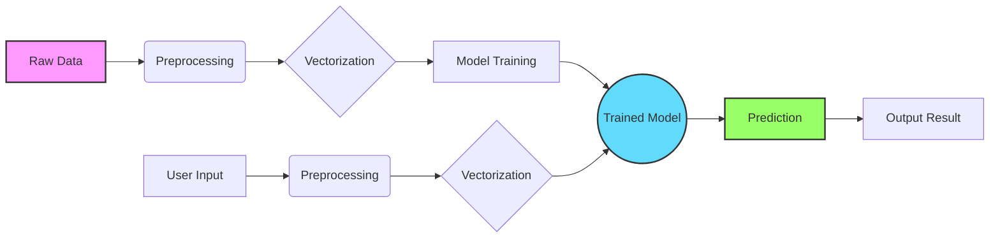

# Spam & Ham Text Classifier


> **Note:** This project is part of the AIO2025 course.

A high-performance command-line interface (CLI) tool designed to classify text messages as either **Spam** or **Ham** (legitimate). Built with Python and Scikit-Learn, it emphasizes modular design, extensibility, and ease of use.

---

## 📚 Table of Contents

- [Introduction](#-introduction)
- [Key Features](#-key-features)
- [Architecture](#-architecture)
- [Installation](#-installation)
- [Usage Guide](#-usage-guide)
- [Project Structure](#-project-structure)
- [Roadmap](#-roadmap)
- [Contributing](#-contributing)
- [License](#-license)

---

## 🚀 Introduction

The **Spam & Ham Text Classifier** allows developers and data scientists to easily train, evaluate, and use machine learning models for text classification. Whether you're filtering SMS messages, emails, or chat logs, this tool provides a flexible pipeline to detect unwanted content.

It supports multiple algorithms out-of-the-box, including Naive Bayes, K-Nearest Neighbors (KNN), Logistic Regression, and Support Vector Machines (SVM).

---

## ✨ Key Features

- **Multi-Model Architecture**: Switch between **Naive Bayes**, **KNN**, **Logistic Regression**, and **SVM** with a simple CLI flag.
- **Interactive Mode**: Test the model in real-time by typing messages directly into the console.
- **Robust Preprocessing**: Includes automated text cleaning, tokenization, and vectorization.
- **Model Persistence**: Automatically saves and loads trained models, vectorizers, and encoders.
- **detailed Feedback**: Provides visual cues (✅/🚫) and clear probability outputs.
- **Extensible**: easy to add new models or preprocessing steps via the `src` directory.

---

## 🏗 Architecture

The project follows a modular pipeline architecture, separating data processing, model training, and inference.



**Data Flow:**
1.  **Preprocessing**: Text is cleaned (lowercased, punctuation removed, stopwords handled).
2.  **Vectorization**: Converted into numerical features using Bag-of-Words (BoW).
3.  **Training**: The selected algorithm learns patterns from the labeled dataset (`dataset/data.csv`).
4.  **Inference**: New text follows the same preprocessing path and is classified by the trained model.

---

## 📦 Installation

### Prerequisites

-   **Python 3.10** or higher
-   **pip** (Python Package Installer)

### Steps

1.  **Clone the Repository**

    ```bash
    git clone https://github.com/ducquan19/text-classification.git
    cd text-classification
    ```

2.  **Set Up a Virtual Environment** (Recommended)

    ```bash
    # Windows
    python -m venv .venv
    .venv\Scripts\activate

    # macOS/Linux
    python3 -m venv .venv
    source .venv/bin/activate
    ```

3.  **Install Dependencies**

    This project uses `uv` or standard `pip`.

    ```bash
    pip install -r requirements.txt
    ```
    *(If `requirements.txt` is missing, dependencies are managed in `pyproject.toml`)*.

---

## 🛠 Usage Guide

The `main.py` script is the entry point for all operations.

### 1. Training a Model

Train a specific model using the `--train` flag. The default model is `naive_bayes`.

```bash
# Train Naive Bayes (Default)
python main.py --train

# Train Logistic Regression
python main.py --train --model logistic

# Force retrain if model already exists
python main.py --train --model svm --force-retrain
```

### 2. Single Prediction

Classify a single text string from the command line.

```bash
python main.py --predict "Congratulations! You've won a $1000 Walmart gift card. Click here to claim."
# Output: 🚫 SPAM
```

### 3. Interactive Mode

Enter a loop where you can continuously type messages to test the model.

```bash
python main.py --interactive --model logistic
```

**Example Session:**
```text
Enter text: Hey, are we still meeting for lunch?
→ ✅ HAM

Enter text: URGENT! Your account has been compromised. Verify now.
→ 🚫 SPAM
```

### 4. Help & Options

View all available commands and model options.

```bash
python main.py --help
```

---

## 📂 Project Structure

```bash
customer-review-sentiment-analysis/
├── config/                  # Configuration details
├── dataset/                 # Data storage (e.g., data.csv)
├── src/
│   ├── models/              # Model implementations (KNN, Naive Bayes, etc.)
│   ├── preprocessing/       # Text cleaning and vectorization logic
│   ├── training/            # Training pipeline scripts
│   ├── evaluation/          # Metrics and evaluation tools
│   ├── inference/           # Prediction logic
│   └── utils/               # Helper utilities
├── trained_models/          # Directory where .pkl models are saved
├── main.py                  # CLI Entry Point
├── app.py                   # Streamlit Web App (Optional/Upcoming)
├── pyproject.toml           # Project metadata and dependencies
└── README.md                # Documentation
```

---

## 🗺 Roadmap

- [x] **CLI Interface**: Robust command-line tools for training and prediction.
- [x] **Multiple Models**: Support for Naive Bayes, KNN, Logistic Regression, SVM.
- [ ] **Web Interface**: A Streamlit dashboard for visual interaction.
- [ ] **API Endpoint**: Fast API implementation for serving predictions via HTTP.
- [ ] **Docker Support**: Containerization for easy deployment.
- [ ] **Advanced Metrics**: Confusion matrix and ROC curve visualization.

---

## 🤝 Contributing

We welcome contributions! Please follow these steps:

1.  **Fork** the repository.
2.  Create a new **Branch** (`git checkout -b feature/AmazingFeature`).
3.  **Commit** your changes (`git commit -m 'Add some AmazingFeature'`).
4.  **Push** to the branch (`git push origin feature/AmazingFeature`).
5.  Open a **Pull Request**.

---

## 📄 License

Distributed under the MIT License. See `LICENSE` for more information.
